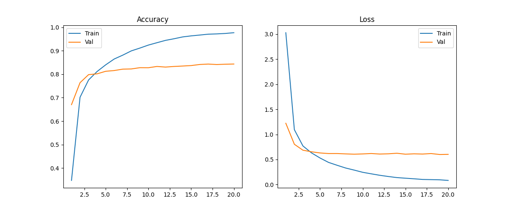

# 使用 ResNet34 训练 CIFAR-100

在搞定了 CIFAR-10（10分类）之后，我决定挑战更高难度的 **CIFAR-100**。这是一个包含 100 个类别、每类仅有 500 张训练图的数据集，对模型的特征提取能力和泛化能力都是巨大的考验。

本次实战我使用了 **ResNet34** 模型，配合迁移学习技巧，最终在测试集上达到了 **84.76%** 的准确率。以下是我的踩坑记录与经验总结。

## 1. 实验配置

为了应对 CIFAR-100 的细粒度分类挑战，我选择了比 ResNet18 更深一点的 ResNet34，并使用了更现代的优化策略。

* **模型架构**: ResNet34 (预训练权重: `timm/resnet34.a1_in1k`)
* **数据集**: CIFAR-100 (100 Classes)
* **优化器**: **Adam** (Weight Decay = 1e-4)
* **调度器**: **Cosine Annealing** (余弦退火)
* **训练策略**: 迁移学习 (Transfer Learning) + 早停机制 (Early Stopping)

## 2. 训练结果分析

训练过程出乎意料的顺利，模型展现了极强的学习能力。

### 📈 训练曲线



从曲线图中可以看到：

* **极速收敛**：得益于 ImageNet 的预训练权重，模型在第 5 个 Epoch 就突破了 80% 的准确率。
* **高精度**：最终测试集准确率定格在 **84.76%**。
* **过拟合现象**：观察日志发现，训练集准确率最终达到了 99% 以上，而验证集停留在 84% 左右。虽然存在过拟合，但在如此少的数据量（每类500张）下，能达到这个泛化性能已经非常令人满意。

### 🧩 混淆矩阵

CIFAR-100 的难点在于有很多“子类”，比如 `Girl`, `Boy`, `Man`, `Woman`。
通过分析混淆矩阵，我发现模型主要的错误都集中在**语义相似的类别**上：

* **Boy vs Girl**: 这是最容易混淆的一对。
* **Maple Tree vs Oak Tree**: 植物类的细微纹理差异很难区分。
* **Worm vs Caterpillar**: 形状极其相似。

但对于特征鲜明的类别（如 `Orange` 橙子, `Motorcycle` 摩托车），模型的识别率几乎达到了 **100%**。

## 3. 踩坑与问题记录

在从 CIFAR-10 迁移到 CIFAR-100 的过程中，我遇到了一些具有代表性的问题，非常有记录价值。

### 🐛 问题一：维度不匹配

在尝试加载训练好的模型进行预测或继续训练时，我遇到了如下报错：

> `RuntimeError: Error(s) in loading state_dict for ResNet: size mismatch for fc.weight: copying a param with shape torch.Size([100, 512]) from checkpoint, the shape in current model is torch.Size([1000, 512]).`

**原因分析**：
`timm.create_model` 默认创建的是 ImageNet 标准的 1000 类模型，而我保存的权重是针对 CIFAR-100 训练的 100 类权重。也就是“坑有1000个，萝卜只有100个”，这就填不进去了。

**解决方案**：
在创建模型时，必须显式指定 `num_classes`，告诉模型“我只要100个坑”：

```python
# 修改前 (报错)
model = timm.create_model('resnet34', checkpoint_path='best.pth')

# 修改后 (成功)
model = timm.create_model('resnet34', num_classes=100, checkpoint_path='best.pth')

```

### 🧐 问题二：关于准确率提升的思考

在训练达到 84% 后，我尝试了更强的数据增强（如 `RandomResizedCrop` 和 `RandomErasing`）试图冲刺更高分数，但发现效果并不明显，甚至在短时间内导致了准确率下降。

**学习心得**：

1. **微调的陷阱**：当你加载一个已经训练得很好的模型（LR已降得很低）进行第二阶段微调时，**千万不能使用大的初始学习率**（如 1e-4）。这会破坏模型已有的特征分布。正确的做法是将学习率降低 10-100 倍（如 1e-6）。
2. **增强的代价**：强数据增强虽然能抗过拟合，但也增加了学习难度，需要更长的 Epochs 来收敛。对于快速验证实验，标准的增强（Flip/Crop）往往性价比最高。

## 4. 总结

这次实验证明了 **ResNet34** 在中等规模图像分类任务上的强大统治力。使用 **84.76%** 的准确率，这个模型已经可以很好地应用于实际场景。

## 5.代码

本次实验基于预先构建的图像分类通用框架进行，此处仅对差异化的微调部分（Fine-tuning）进行说明。

```python
class Config:
    # --- 数据集设置 ---
    USE_CUSTOM_DATASET = False  # 设为False，即使用内置数据集
    CUSTOM_DATA_ROOT = "flower_data"  # 自定义数据集路径
    BUILTIN_NAME = "CIFAR100"  # 内置数据集名称
    DATA_DOWNLOAD_ROOT = "./data"  # 下载缓存路径

    # --- 结果保存 ---
    SAVE_DIR_ROOT = "./results"  # 结果保存根目录
    SAVE_DIR = ""  # (运行时自动生成)

    # --- 模型设置 ---
    MODEL_NAME = "resnet34"  # 模型名称 (timm库支持的名称)
    CHECKPOINT_PATH = ""  # 初始预训练权重 (迁移学习用)
    RESUME_PATH = ""  # 断点续训文件路径 (.pth)
    NUM_CLASSES = 0  # (运行时自动覆盖)

    # --- 训练超参数 ---
    BATCH_SIZE = 32  # 批次大小
    EPOCHS = 20  # 训练总轮数
    LR = 1e-4  # 初始学习率
    WEIGHT_DECAY = 1e-4  # L2正则化系数
    SEED = 42  # 随机种子

    # --- 策略选择 ---
    OPTIMIZER_NAME = 'adam'  # 使用 'adam' 优化器
    SCHEDULER_NAME = 'cosine'  # 使用 '余弦退火' 学习率调度策略

    # --- 早停设置 ---
    # 0 或 None 表示关闭早停，> 0 表示开启早停的耐心轮数
    EARLY_STOP_PATIENCE = 0  # 早停耐心轮数 (0=关闭)

    DEVICE = torch.device("cuda" if torch.cuda.is_available() else "cpu")
```