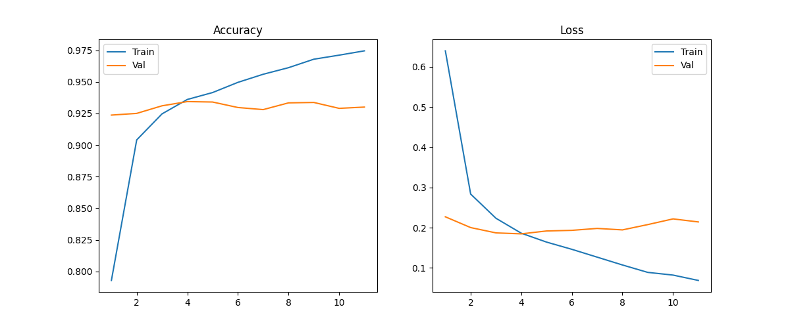
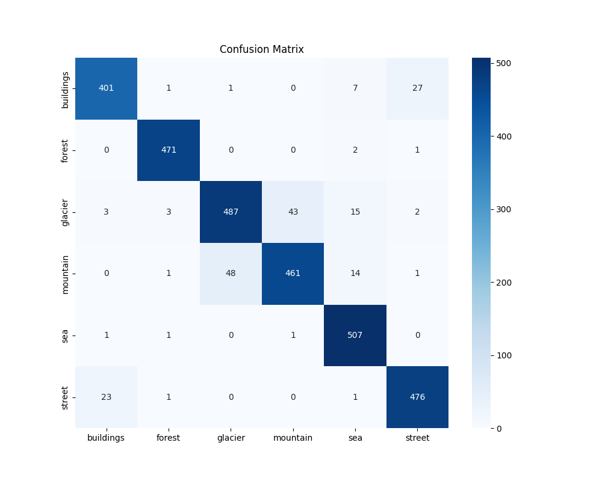

# ResNet50 训练 Intel 图像分类

在完成基础的数据集训练后，我将目光投向了更贴近真实场景的 **Intel Image Classification** 数据集。这是一个包含 6 类自然风光与城市建筑的数据集（Buildings, Forest, Glacier, Mountain, Sea, Street）。

本次实验我使用了工业界最常用的 **ResNet50** 模型，配合迁移学习策略，仅仅训练了 4 个 Epoch 就达到了最佳性能。以下是我的详细复盘。

## 1. 实验配置 (Setup)

为了应对自然场景的纹理复杂性，我选择了特征提取能力更强的 ResNet50，并启用了 ImageNet 预训练权重。

* **模型**: ResNet50 (`timm/resnet50.a1_in1k`) 

* **数据集**: Intel Image Classification (6 Classes) 

* **优化器**: AdamW

* **调度器**: Cosine Annealing (余弦退火) 

* **早停策略**: Patience = 7 (耐心值为 7 轮) 

## 2. 训练过程分析：极速收敛与早停

训练过程非常顺利，甚至可以用“惊人”来形容迁移学习的效率：

* **起步即巅峰**：
仅仅在 **Epoch 1**，验证集准确率（Val Acc）就直接飙升到了 **92.37%** 。这说明 ImageNet 预训练模型中包含的“山、水、建筑”特征可以完美迁移到这个数据集上。

* **最佳时刻**：
模型在 **Epoch 4** 达到了全场最佳性能，验证集准确率 **93.43%**，Loss 降至 **0.1864** 。

* **早停触发**：
从 Epoch 5 开始，虽然训练集准确率一路冲高至 97.45%，但验证集准确率一直在 92.8% - 93.3% 之间徘徊，甚至 Loss 开始轻微反弹 。
最终在 **Epoch 11**，由于连续 7 轮没有突破 Epoch 4 的记录，**早停机制 (Early Stopping)** 触发，自动终止了训练 。这成功帮我节省了算力，并防止了进一步的过拟合。



## 3. 结果深度评估

最终在测试集（复用的 Val 集）上的总体评估结果如下：

* **Accuracy**: **93.43%** 

* **Weighted F1-Score**: 0.9339 

### 3.1 谁表现最好？

* **Forest (森林)**：模型简直是“一眼辨真”，Recall 高达 **99.37%**，几乎没有漏网之鱼 。

* **Sea (海洋)**：表现同样强悍，Recall 达到 **99.41%** 。

*分析*：这两类特征极其明显（绿色的纹理、蓝色的水面），模型学得非常快。

### 3.2 谁在“打架”？（混淆矩阵分析）

虽然总体分高，但查看混淆矩阵可以发现两个明显的“重灾区”：

**1. 冰川 (Glacier) vs. 山脉 (Mountain)** —— *最大的难点*

* **43 张** 冰川被误认成了山脉。
* **48 张** 山脉被误认成了冰川。
* *原因分析*：这是本数据集最经典的难题。带雪的山峰（Mountain）和积雪的冰川（Glacier）在视觉特征上极度相似（都是白色、岩石质感），ResNet50 在这里也犯了迷糊，导致这两类的 Recall 只有 88% 左右 。

**2. 建筑 (Buildings) vs. 街道 (Street)**

* **27 张** 建筑被误认成了街道。
* **23 张** 街道被误认成了建筑。
* *原因分析*：这两类都属于“城市景观”。街道图片中往往也包含两旁的建筑物，模型可能会关注到图片边缘的楼房特征而误判。



## 4. 总结

这次实验证明了 **ResNet50 + 迁移学习** 是解决中等难度图像分类任务的“大杀器”。在不需要繁琐调参的情况下，4 个 Epoch 就能达到 93% 的工业可用水平。

## 5.代码

本次实验基于预先构建的图像分类通用框架进行，此处仅对差异化的微调部分（Fine-tuning）进行说明。

```python
class Config:
    # --- 数据集设置 ---
    USE_CUSTOM_DATASET = True  # <--- [可微调] True=自定义文件夹, False=内置
    CUSTOM_DATA_ROOT = "./datasets/Intel_Image_Classification"  # <--- [可微调] 自定义数据集路径
    BUILTIN_NAME = ""  # <--- [可微调] 内置数据集名称
    DATA_DOWNLOAD_ROOT = "./data"  # <--- [可微调] 下载缓存路径

    # --- 结果保存 ---
    SAVE_DIR_ROOT = "./results"  # <--- [可微调] 结果保存根目录
    SAVE_DIR = ""  # (运行时自动生成)

    # --- 模型设置 ---
    MODEL_NAME = "resnet50"  # <--- [可微调] 模型名称 (timm库支持的名称)
    CHECKPOINT_PATH = ""  # <--- [可微调] 初始预训练权重 (迁移学习用)
    RESUME_PATH = ""  # <--- [可微调] 断点续训文件路径 (.pth)
    NUM_CLASSES = 0  # (运行时自动覆盖)

    # --- 训练超参数 ---
    BATCH_SIZE = 16  # <--- [可微调] 批次大小
    EPOCHS = 50  # <--- [可微调] 训练总轮数
    LR = 1e-4  # <--- [可微调] 初始学习率
    WEIGHT_DECAY = 1e-4  # <--- [可微调] L2正则化系数
    SEED = 42  # <--- [可微调] 随机种子

    # --- 策略选择 ---
    OPTIMIZER_NAME = 'adamw'  # <--- [可微调] 'adamw', 'adam', 'sgd'
    SCHEDULER_NAME = 'cosine'  # <--- [可微调] 'plateau', 'cosine', 'step'

    # --- 早停设置 ---
    # 0 或 None 表示关闭早停，> 0 表示开启早停的耐心轮数
    EARLY_STOP_PATIENCE = 7  # <--- [可微调] 早停耐心轮数 (0=关闭)

    DEVICE = torch.device("cuda" if torch.cuda.is_available() else "cpu")
```
